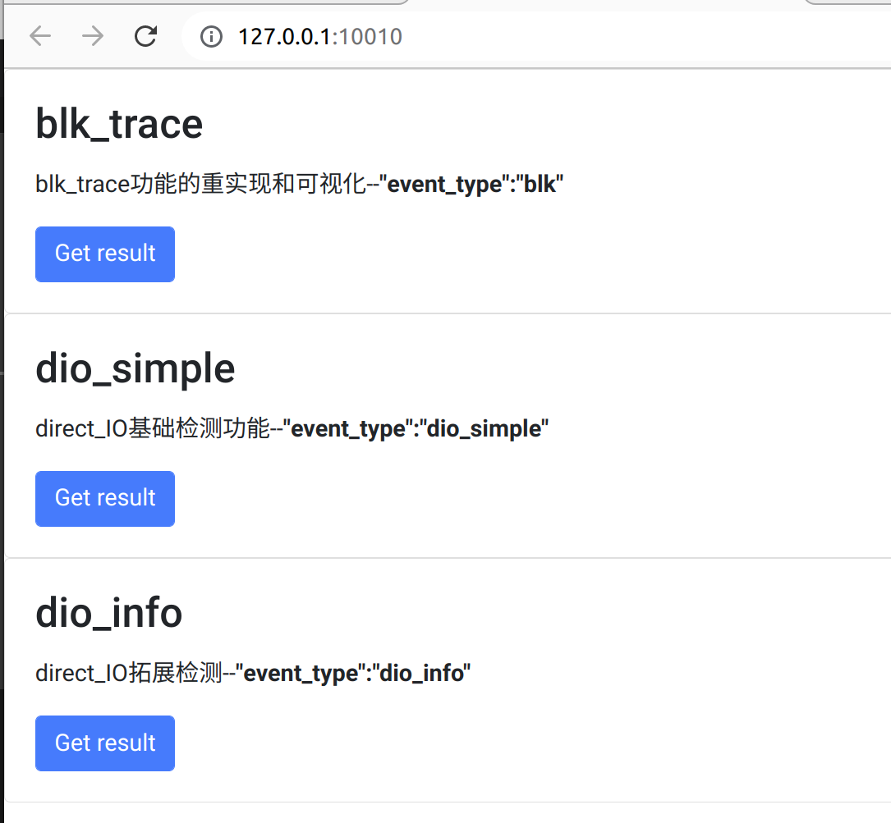
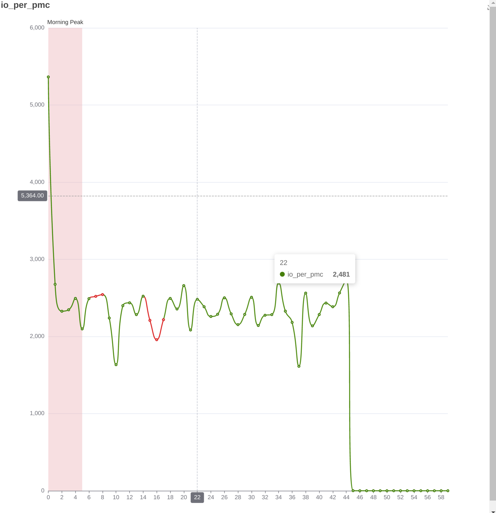
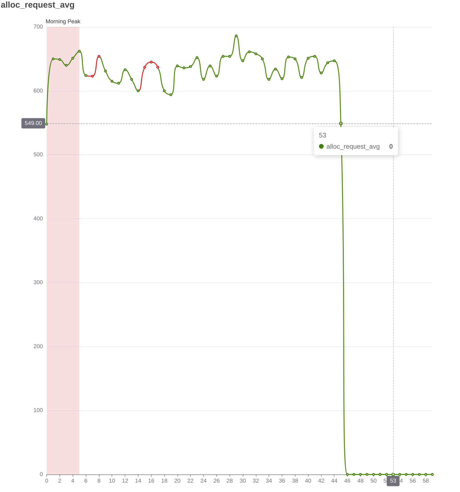

# stortrace的block trace功能

## blktrace的工作流程
主要根据用户输入的磁盘设备，收集这个设备上每个IO调度情况，收集的过程是交给当前服务器的每一个core来做的，最后每一个core将各自处理的请求 收集到的结果保存在一个binary文件中
 
ringbuf和percpu效率因为软件效率问题可以参考
[percpu and ringbuf](https://gitee.com/fangwater/stortrace/blob/dev/doc/gitbook/BPF_ring_buffer.md)
```bash
fio -filename=./test_4k_random  -direct=1 -ioengine=psync -iodepth 1 -rw=randrw -bs=4k -size=4G -numjobs=8 -runtime=45 -group_reporting -name=random_4k
cmake .. -DCMAKE_BUILD_TYPE=Release

blktrace -d /dev/nvme0n1 -o nvme-trace -w 50
```
 
blkparse 把之前的core.bin合并 生成可读的明文

blk_parse的汇总信息
```bash
blkparse -i nvme-trace -d nvme-trace.bin -o nvme-trace.txt
```
最后利用比如`iowatch`之类的方式生成`svg`图片

这一思路和`stortrace`的思路是很类似的 后期可以进行基准测试进行对比
 

实现blk_trace的基础功能
https://zhuanlan.zhihu.com/p/355548200
[1]延迟衡量指标
- D2C 
硬件驱动设备执行延迟
代表的是设备的硬件能力。`D2C` 的 `AVG` 越大，代表设备越慢，延迟越高。 D2C的`MAX`越大，代表设备的`tail latency`越高。 `N`代表 `btt` 统计到的 D2C 的 `IO` 个数

- Q2C
代表的是一个`IO`请求在块层的全部时间
`Q2C - D2C`就代表了`block layer`软件栈引入的延迟

- Stage latency
这一方面`blk_trace`更偏向与`hdd`硬件的下发路径


[2]额外指标
- Q2Q
time between requests sent to the block layer
IO到达block曾的时间间隔 可以用来探讨负载的均匀性

- Q2M
IO有多少被merge而没有生成独立的request进行下发 可以用来探讨调度算法的性能等
  

[3]事后追踪能力
事后追踪能力定义为, 当一个系统汇报了IO延迟高的时候, 可能是几个小时或几天后,但是问题可以复现,那么使用工具来分析 IO 延迟高的原因, `blktrace`从分类来看属于事后追踪能力

[4]离散的IO事件的关联

内核写入到`relay fs`的数据，都是一些单独的事件


`btt` 一个一个的读取`IO`，加载到红黑树里面，按照`lba + offset`排序。当读取到 `C` 的事件时，扫描整棵树，找到 `C`的区间覆盖了`Q`区间的`IO`，将它们进行关联

这种区间覆盖的好处是可以处理`IO merge` 例如有两个`IO`，分别是`io1 [0,100]`, `io2 [100, 200]`, 合并之后的`IO`为`[0,200]`，当`[0,200]`完成时，可以查询到 `io1`, `io2` 被覆盖，那么就可以计算`io1` 和`io2`的延迟了

对于`IO split`，一个真实的序列如下
```c
8,32  15        1     0.000000000 348610  Q   R 0 + 32 [fio]
8,32  15        2     0.000003960 348610  X   R 0 / 8 [fio]
8,32  15        3     0.000031340 348610  G   R 0 + 8 [fio]
8,32  15        4     0.000032750 348610  P   N [fio]
8,32  15        5     0.000035840 348610  X   R 8 / 16 [fio]
8,32  15        6     0.000038211 348610  G   R 8 + 8 [fio]
8,32  15        7     0.000041121 348610  X   R 16 / 24 [fio]
8,32  15        8     0.000043671 348610  G   R 16 + 8 [fio]
8,32  15        9     0.000047741 348610  G   R 24 + 8 [fio]
8,32  15       10     0.000049651 348610  U   N [fio] 4
8,32  15       11     0.000050841 348610  I   R 0 + 8 [fio]
8,32  15       12     0.000051451 348610  I   R 8 + 8 [fio]
8,32  15       13     0.000051971 348610  I   R 16 + 8 [fio]
8,32  15       14     0.000052811 348610  I   R 24 + 8 [fio]
8,32  15       15     0.000063541 348610  D   R 0 + 8 [fio]
8,32  15       16     0.000072011 348610  D   R 8 + 8 [fio]
8,32  15       17     0.000076401 348610  D   R 16 + 8 [fio]
8,32  15       18     0.000079891 348610  D   R 24 + 8 [fio]
8,32  15      216     0.001081786 348610  C   R 0 + 8 [0]
8,32  15      217     0.001095816 348610  C   R 0 + 16 [0]
8,32  15      218     0.001100176 348610  C   R 0 + 24 [0]
8,32  15      219     0.001104346 348610  C   R 0 + 32 [0]
```
可以看到，当序列号为 219 的事件收到后，那么可以查询到红黑树的序列号为 1 的 Q 事件，表明整个 IO 完成了, 216~ 218 事件不用关心


## blktrace的效率
理论上 blktrace在每个cpu上启动一个线程 开销不见得小
其次percpu不如ringbuf


## stortrace实现

### 延迟衡量指标
#### D2C
对硬件驱动设备执行延迟，`stortrace`的采样对应两种path
HDD和NVME会给出更细化的延迟分析
对于`scsi`协议的设备 D2C的统计包括
```
blk_mq_start_request->scsi_softirq_done->scsi_end_request->blk_account_io_done
```
以上被分为3个区间
[1]scsi设备执行 直到设备进行软中断callback
[2]进行校验和清理
[3]统计bio的执行

对于`nvme`协议的设备 
```
blk_mq_start_request-->nvme_pci_complete_rq->nvme_complete_rq->blk_account_io_done
```
区别在于 nvme有极高的执行速度 因此不存在一个等待中断的过程 而是同一个进程在等待执行结束和确认
[1]nvme设备执行
[2]进行校验和清理
[3]统计bio的执行

`stortrace`对两种设备检测给出阶段延迟结果
不同与`blk_trace`给出`max`和`min` `stortrace`会给出`avg`和数据分布`(bucket mode)` 更有利于观测结果

### Q2C
`stortrace`暂时只关注完整执行并下发的`request` 因此和`blk_trace`的定义在这里有所区别 根据`5.10`内核的代码，`stortrace`的观测起点是`bio`已经获得了设备硬件队列上的`request`分配 但`Q2C - D2C`同样代表了`block layer`软件栈引入的延迟
具体的 可以参考
`stortrace`把`block layer`软件栈的延迟，分为成功分配到`request`开始的`alloc_request`阶段,还有`Plug`,`scheduling`,`dispatch`三个阶段
由于不是每一个`bio`都会获得`request` 正如下面的`merge`,因此`stortrace`
采用回溯的方式，只有到达了`C`的request才会被回溯之前的信息，反向推理出走了`merge`
的`block io`

具体的 由于`request`的下发其实并非一个线性的关系，`blk_trace`其实并不能很好的体现下发流程,`stortrace`的描述更为清晰，例如`plug`对应的就是内核的`plug`机制,若关闭就不会存在这一阶段，`scheduling`对应的就是进入调度队列到离开的过程，对于`nvme`默认`None`的调度，就不存在这一个阶段，而会直接进入`dispatch`，即IO离开`block`层到IO的时间


例如在nvme上采样
```
            ALL           MIN           AVG           MAX           N
--------------- ------------- ------------- ------------- -----------

Q2Q               0.000000001   0.000038201   2.071867080      626045
Q2G               0.000000121   0.000000447   0.141658930      625977
G2I               0.000002488   0.000002488   0.000002488           1
Q2M               0.000000066   0.000000189   0.000001262          69
M2D               0.000001797   0.000130310   0.000741330          69
D2C               0.000006409   0.000086187   0.113239873      625508
Q2C               0.000006767   0.000179834   0.239753745      626042
```
仅有一个`G2I`发生 这代表几乎不会出现的情况 就是走调度器 而`stortrace`就会差异化的显
表示这种区别


### Stage latency
`plug`,`scheduling`,`dispatch`,`execute`
``

### Q2Q
IO到达block曾的时间间隔，实际上可以视为`IOPS`
`stortrace`更倾向于从`IOPS`的角度统计 并不考虑`merge`阶段，而是观察实际执行的`request`数量


### Q2M
IO有多少被merge而没有生成独立的request进行下发 可以用来探讨调度算法的性能等
`stortrace`记录的所有`bio`来自`blk_mq_submit_bio`函数接口

但由于`bio`是批次分配 然后复用 因此bio的指针无法对单个bio的独立性进行区分


但经过源码阅读可以发现，`split`操作近似于对过大的`bio`进行裁剪 其必然会重新经过`blk_mq_submit_bio`的接口 只有merge才会经过`blk_mq_submit_bio`且不经过第二个阶段`rq_qos_track(bio 流量统计)`

由此可以考虑 只需要把两个阶段的`bio`做差就可以 具体方法为利用`hash_map`但可能带来额外的内存开销

具体实现方式为
map.insert(K,V){bio_ptr,bio_enter_time}

然后在qos处查看bio的指针
好处是可以额外的提供一个数据 后期可以做到实时 即单位时间内的merge率

问题在于具体机制的实现

如果直接使用map 则已经分配但被merge的bio会持续的留存在hashap中 会导致hashmap的空间持续扩大 类似内存泄露 及时bio的数量并不是无限的 hashmap中保存的规模最多等于系统中所有的bio个数 但也不是可以接受的量

这里是一个tradeoff, `stortrace`选择离线计算这一个指标，和`blk_trace`相同

```
[bio_ptr,enter_time,...]
[bio_ptr,get_request_time,...]
```
我们假设相同的`bio_ptr`在时间上一定是最接近的 则转化为一个二阶段的查询问题
我们使用一个muti-map解决

### 事后追踪能力
`blk_trace`对于高延迟区间的识别是手动分析的 而`stortrace`则可以自动的识别
同样是基于`tdigest`的算法


### 离散的IO事件的关联
`stortrace`对IO完成的确认方式和`blk_trace`不同 这是原理上的差异


## Stortrace基准测试
### Expected Result
基于操作便利 直接简化启动可视化的方法
```c
sudo ./stortrace --mode display --conf ../blk_trace_config.json 
```
直接可以看到web界面

#### Q2Q
根据前文的描述 我们认为`request`比`bio`更好的能代表负载均衡 因此用`rq`的到达频率来替代`Q2Q`这一指标 实质上可以理解为`IOPS` 只是支持选择更小的区间 我们定义为`IO_per_PMC`


如图为一次测量中IO频率的变化

#### Q2M
同样参考前文 Q2M的观测转化为 单位时间内
$$
\frac{submit-bio}{get-request-bio} \leq 1
$$

- `MERGE_RATE`
  


#### IO读写比
单位采样时间内 读写IO占据的比例 下一次提交实现 用于相关性分析

#### 进程操作
单位采样时间内 各个进程IO占据的比例 下一次提交实现 用于相关性分析


#### 落盘分布
参考性的给出IO写盘的位置局部性分析 可以调整区间大小


会显示能检测到的所有设备 分开统计

可以选择不同的切分大小


#### 延迟分布
这一部分主要替代类似与Q2C D2C Q2I`等功能
对于`block_Io`这种频率极高的 观测单个几乎没有意义
`stortrace`对于延迟给出全局性的两类图表
全阶段延迟随时间的变化情况 
单个阶段延迟随时间的变化情况 额外的 给出延迟分布的统计

- [1] `sum--替代Q2C`


- [2] `alloc_request--替代Q2G`



- [3] `plug`


- [4] `scheduling`
这里因为是NVME 没有调度


- [5] `dispatch`


- [6] `execute`


- [7] `verify`


### Env
[1]HDD 7200
[2]NVME 
[3]i7-10700


### 额外负载
随机IO 
选择使用`stortrace`
```
Jobs: 8 (f=8): [m(8)][100.0%][r=121MiB/s,w=123MiB/s][r=31.1k,w=31.4k IOPS][eta 00m:00s]
random_4k: (groupid=0, jobs=8): err= 0: pid=25681: Mon Sep 19 02:02:00 2022
  read: IOPS=30.7k, BW=120MiB/s (126MB/s)(5389MiB/45001msec)
    clat (usec): min=35, max=7113, avg=244.72, stdev=150.01
     lat (usec): min=35, max=7113, avg=244.78, stdev=150.01
    clat percentiles (usec):
     |  1.00th=[   78],  5.00th=[   93], 10.00th=[  106], 20.00th=[  133],
     | 30.00th=[  163], 40.00th=[  204], 50.00th=[  239], 60.00th=[  265],
     | 70.00th=[  293], 80.00th=[  326], 90.00th=[  383], 95.00th=[  437],
     | 99.00th=[  570], 99.50th=[  840], 99.90th=[ 1270], 99.95th=[ 1467],
     | 99.99th=[ 5014]
   bw (  KiB/s): min=107688, max=127936, per=100.00%, avg=122642.16, stdev=399.60, samples=712
   iops        : min=26922, max=31984, avg=30660.52, stdev=99.90, samples=712
  write: IOPS=30.7k, BW=120MiB/s (126MB/s)(5397MiB/45001msec); 0 zone resets
    clat (usec): min=9, max=45754, avg=14.91, stdev=127.27
     lat (usec): min=9, max=45755, avg=15.01, stdev=127.27
    clat percentiles (nsec):
     |  1.00th=[10688],  5.00th=[11456], 10.00th=[11840], 20.00th=[12352],
     | 30.00th=[12736], 40.00th=[13120], 50.00th=[13376], 60.00th=[14016],
     | 70.00th=[14656], 80.00th=[15296], 90.00th=[17280], 95.00th=[20608],
     | 99.00th=[24448], 99.50th=[26240], 99.90th=[31360], 99.95th=[34560],
     | 99.99th=[61184]
   bw (  KiB/s): min=108024, max=133912, per=100.00%, avg=122827.33, stdev=599.20, samples=712
   iops        : min=27006, max=33478, avg=30706.83, stdev=149.80, samples=712
  lat (usec)   : 10=0.03%, 20=47.12%, 50=2.88%, 100=3.74%, 250=23.31%
  lat (usec)   : 500=21.88%, 750=0.77%, 1000=0.10%
  lat (msec)   : 2=0.16%, 4=0.01%, 10=0.02%, 20=0.01%, 50=0.01%
  cpu          : usr=1.02%, sys=2.52%, ctx=2761221, majf=0, minf=136
  IO depths    : 1=100.0%, 2=0.0%, 4=0.0%, 8=0.0%, 16=0.0%, 32=0.0%, >=64=0.0%
     submit    : 0=0.0%, 4=100.0%, 8=0.0%, 16=0.0%, 32=0.0%, 64=0.0%, >=64=0.0%
     complete  : 0=0.0%, 4=100.0%, 8=0.0%, 16=0.0%, 32=0.0%, 64=0.0%, >=64=0.0%
     issued rwts: total=1379630,1381558,0,0 short=0,0,0,0 dropped=0,0,0,0
     latency   : target=0, window=0, percentile=100.00%, depth=1

Run status group 0 (all jobs):
   READ: bw=120MiB/s (126MB/s), 120MiB/s-120MiB/s (126MB/s-126MB/s), io=5389MiB (5651MB), run=45001-45001msec
  WRITE: bw=120MiB/s (126MB/s), 120MiB/s-120MiB/s (126MB/s-126MB/s), io=5397MiB (5659MB), run=45001-45001msec

Disk stats (read/write):
  nvme0n1: ios=1376316/1378970, merge=0/63, ticks=330115/22192, in_queue=352309, util=99.80%
```
随机IO 选择使用`blk_trace`
```
fio-3.29
Starting 8 processes
Jobs: 8 (f=8): [m(8)][100.0%][r=123MiB/s,w=123MiB/s][r=31.6k,w=31.6k IOPS][eta 00m:00s] 
random_4k: (groupid=0, jobs=8): err= 0: pid=26753: Mon Sep 19 02:06:34 2022
  read: IOPS=30.9k, BW=121MiB/s (127MB/s)(5429MiB/45001msec)
    clat (usec): min=36, max=24110, avg=244.44, stdev=154.45
     lat (usec): min=36, max=24110, avg=244.49, stdev=154.45
    clat percentiles (usec):
     |  1.00th=[   76],  5.00th=[   91], 10.00th=[  105], 20.00th=[  131],
     | 30.00th=[  163], 40.00th=[  204], 50.00th=[  239], 60.00th=[  265],
     | 70.00th=[  293], 80.00th=[  326], 90.00th=[  383], 95.00th=[  437],
     | 99.00th=[  570], 99.50th=[  840], 99.90th=[ 1270], 99.95th=[ 1467],
     | 99.99th=[ 5080]
   bw (  KiB/s): min=50280, max=129176, per=100.00%, avg=123548.67, stdev=1083.17, samples=712
   iops        : min=12570, max=32294, avg=30887.17, stdev=270.79, samples=712
  write: IOPS=30.9k, BW=121MiB/s (127MB/s)(5437MiB/45001msec); 0 zone resets
    clat (usec): min=8, max=53917, avg=13.52, stdev=286.96
     lat (usec): min=8, max=53918, avg=13.61, stdev=286.96
    clat percentiles (usec):
     |  1.00th=[    9],  5.00th=[   10], 10.00th=[   10], 20.00th=[   10],
     | 30.00th=[   10], 40.00th=[   10], 50.00th=[   11], 60.00th=[   11],
     | 70.00th=[   11], 80.00th=[   12], 90.00th=[   15], 95.00th=[   18],
     | 99.00th=[   22], 99.50th=[   24], 99.90th=[   51], 99.95th=[   56],
     | 99.99th=[ 3752]
   bw (  KiB/s): min=51344, max=134384, per=100.00%, avg=123733.12, stdev=1156.54, samples=712
   iops        : min=12836, max=33596, avg=30933.28, stdev=289.13, samples=712
  lat (usec)   : 10=24.79%, 20=24.49%, 50=0.70%, 100=4.09%, 250=23.12%
  lat (usec)   : 500=21.73%, 750=0.80%, 1000=0.09%
  lat (msec)   : 2=0.16%, 4=0.01%, 10=0.02%, 20=0.01%, 50=0.01%
  lat (msec)   : 100=0.01%
  cpu          : usr=0.95%, sys=1.31%, ctx=2781774, majf=0, minf=144
  IO depths    : 1=100.0%, 2=0.0%, 4=0.0%, 8=0.0%, 16=0.0%, 32=0.0%, >=64=0.0%
     submit    : 0=0.0%, 4=100.0%, 8=0.0%, 16=0.0%, 32=0.0%, 64=0.0%, >=64=0.0%
     complete  : 0=0.0%, 4=100.0%, 8=0.0%, 16=0.0%, 32=0.0%, 64=0.0%, >=64=0.0%
     issued rwts: total=1389882,1391857,0,0 short=0,0,0,0 dropped=0,0,0,0
     latency   : target=0, window=0, percentile=100.00%, depth=1

Run status group 0 (all jobs):
   READ: bw=121MiB/s (127MB/s), 121MiB/s-121MiB/s (127MB/s-127MB/s), io=5429MiB (5693MB), run=45001-45001msec
  WRITE: bw=121MiB/s (127MB/s), 121MiB/s-121MiB/s (127MB/s-127MB/s), io=5437MiB (5701MB), run=45001-45001msec

Disk stats (read/write):
  nvme0n1: ios=1386581/1390241, merge=10/53, ticks=335406/54250, in_queue=389661, util=99.80%

```
随机IO 不开启任何
```
fio-3.29
Starting 8 processes
Jobs: 8 (f=8): [m(8)][100.0%][r=123MiB/s,w=123MiB/s][r=31.5k,w=31.4k IOPS][eta 00m:00s]
random_4k: (groupid=0, jobs=8): err= 0: pid=26128: Mon Sep 19 02:03:32 2022
  read: IOPS=31.5k, BW=123MiB/s (129MB/s)(5529MiB/45001msec)
    clat (usec): min=38, max=7095, avg=242.83, stdev=151.40
     lat (usec): min=38, max=7095, avg=242.86, stdev=151.40
    clat percentiles (usec):
     |  1.00th=[   75],  5.00th=[   90], 10.00th=[  103], 20.00th=[  129],
     | 30.00th=[  161], 40.00th=[  202], 50.00th=[  237], 60.00th=[  265],
     | 70.00th=[  289], 80.00th=[  326], 90.00th=[  383], 95.00th=[  437],
     | 99.00th=[  570], 99.50th=[  840], 99.90th=[ 1270], 99.95th=[ 1450],
     | 99.99th=[ 5014]
   bw (  KiB/s): min=115736, max=130312, per=100.00%, avg=125839.28, stdev=316.63, samples=712
   iops        : min=28934, max=32578, avg=31459.82, stdev=79.16, samples=712
  write: IOPS=31.5k, BW=123MiB/s (129MB/s)(5537MiB/45001msec); 0 zone resets
    clat (usec): min=8, max=3460, avg=10.59, stdev= 7.61
     lat (usec): min=8, max=3460, avg=10.67, stdev= 7.61
    clat percentiles (nsec):
     |  1.00th=[ 8640],  5.00th=[ 8896], 10.00th=[ 9024], 20.00th=[ 9152],
     | 30.00th=[ 9280], 40.00th=[ 9408], 50.00th=[ 9536], 60.00th=[ 9920],
     | 70.00th=[10432], 80.00th=[10944], 90.00th=[13376], 95.00th=[16768],
     | 99.00th=[20096], 99.50th=[22144], 99.90th=[27776], 99.95th=[30848],
     | 99.99th=[49920]
   bw (  KiB/s): min=113240, max=137048, per=100.00%, avg=126027.69, stdev=553.81, samples=712
   iops        : min=28310, max=34262, avg=31506.92, stdev=138.45, samples=712
  lat (usec)   : 10=30.22%, 20=19.27%, 50=0.54%, 100=4.35%, 250=23.12%
  lat (usec)   : 500=21.45%, 750=0.78%, 1000=0.09%
  lat (msec)   : 2=0.16%, 4=0.01%, 10=0.02%
  cpu          : usr=0.98%, sys=1.04%, ctx=2832834, majf=0, minf=128
  IO depths    : 1=100.0%, 2=0.0%, 4=0.0%, 8=0.0%, 16=0.0%, 32=0.0%, >=64=0.0%
     submit    : 0=0.0%, 4=100.0%, 8=0.0%, 16=0.0%, 32=0.0%, 64=0.0%, >=64=0.0%
     complete  : 0=0.0%, 4=100.0%, 8=0.0%, 16=0.0%, 32=0.0%, 64=0.0%, >=64=0.0%
     issued rwts: total=1415460,1417351,0,0 short=0,0,0,0 dropped=0,0,0,0
     latency   : target=0, window=0, percentile=100.00%, depth=1

Run status group 0 (all jobs):
   READ: bw=123MiB/s (129MB/s), 123MiB/s-123MiB/s (129MB/s-129MB/s), io=5529MiB (5798MB), run=45001-45001msec
  WRITE: bw=123MiB/s (129MB/s), 123MiB/s-123MiB/s (129MB/s-129MB/s), io=5537MiB (5805MB), run=45001-45001msec

Disk stats (read/write):
  nvme0n1: ios=1412133/1414079, merge=0/13, ticks=339762/11886, in_queue=351652, util=99.80%
```
fio random 4k 16线程 写入 direct IO

IOps 看不到区别
r=31.1k,w=31.4k IOPS
r=31.6k,w=31.6k IOPS
r=31.5k,w=31.4k IOPS


### Compare with blk_trace
结合上图 首先分析标准差
由于读操作开销较大 反映不敏感 写操作stortrace和blk-trace都带来了波动 但stotrace更小

额外开销上 读操作几乎看不出区别 因为都能达到设备负载的上限
写操作虽然频率不变 但延迟变化显著 

blk-trace大概增加35%的延迟 stotrace增加50% 

考虑到此时是开启了进程过滤操作的 关闭之后就可以直接降低5%开销
clat (usec): min=9, max=33006, avg=14.58, stdev=102.89
    lat (usec): min=9, max=33006, avg=14.72, stdev=102.89

优点
[1]大部分计算是运行时 用了一些hash 所以没有太多额外计算 可以统计一些blk-trace不好做的指标 

[2]能区分进程

缺点
[1]比blk-trace会额外多10%作用的开销(write 极端情况 15ns级别)


