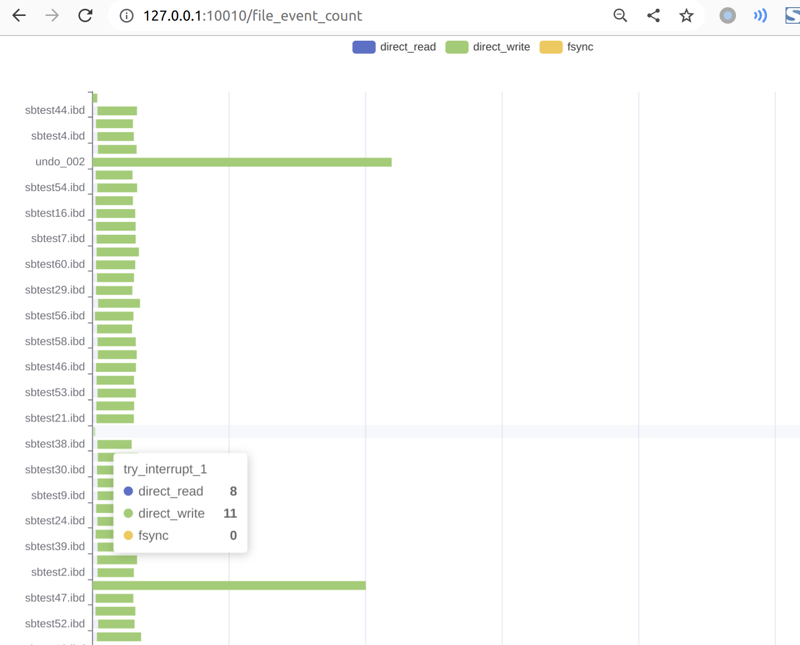

# Mysql example

## Innodb set
Mysql现在常用O_direct的方式进行数据落盘，原因可参考
https://dev.mysql.com/doc/refman/5.7/en/optimizing-innodb-diskio.html
https://zhuanlan.zhihu.com/p/134669835

Innodb在O_direct模式下的工作方式可以参考


可以通过修改
```bash
/etc/my.cnf
[mysqld]
innodb_flush_method=O_DIRECT
# Disabling symbolic-links is recommended to prevent assorted security risks
symbolic-links=0
```
然后重启mysql
```
sudo systemctl start mysqld
sudo systemctl status mysqld
```
登录后查看
```
mysql -u root -p
show variables like 'innodb_flush_method';
```

结果为
```
show variables like 'innodb_flush_method';
+---------------------+----------+
| Variable_name       | Value    |
+---------------------+----------+
| innodb_flush_method | O_DIRECT |
+---------------------+----------+
1 row in set (0.00 sec)
```
表示已经成功更换为Direct_io模式

## Data prepare
如没有安装sysbench可参考
```
sudo yum -y install sysbench
```
openeular对应的版本为
```
sysbench --version
sysbench 1.0.20
```
首先进行数据准备
```
create database sbtest;
```

```
sysbench  /usr/share/sysbench/oltp_common.lua --time=60 --mysql-host=127.0.0.1 --mysql-port=3306 --mysql-user=root --mysql-password= --mysql-db=sbtest --table-size=10000 --tables=64 --threads=32 --report-interval prepare
```
```
sysbench /usr/share/sysbench/oltp_read_write.lua --mysql-host=127.0.0.1 --mysql-port=3306  --mysql-user=root --mysql-password=  --mysql-db=sbtest  --tables=64 --table-size=10000  --threads=8 --report-interval=10 --time=120 run >> clean_rw_mysql.log
```

## Simple trace
首先使用stortrace的simple模式
```
sudo dnf -y install liburing
sudo yum install -f glog* 
```
```
sudo ./stortrace --help
stortrace: 
Disk_io trace and analysis tools for openeuler based on ebpf
Document: 
https://gitee.com/openeuler/stortrace

  Flags from /home/fanghznvme/stortrace/main.cpp:
    -conf (path to the trace mode config, json format) type: string default: ""
    -extra_path (path to dump visualization data) type: string default: ""
    -flask_server (visualization server path) type: string
      default: "../vis/server.py"
    -ip (ip of the visualization server run) type: string default: "127.0.0.1"
    -log_path (path to log record data, set at config of trace mode)
      type: string default: ""
    -mode (define the mode of stortrace task) type: string default: "trace"
    -port (port of the visualization server run) type: string default: "10010"
    -vis_data (path of visualization data) type: string default: ""
```

`--help`可以快速查看参数

首先设置`config` 保存为 `mysql_simple.json`
```json
{
    "name":"mysql_simple_demo",
    "event_type":"dio",
    "trace_level":"simple",
    "logger_io_uring_depth":32,
    "select_target":{
        "pid":-1,
        "common":"",
        "files":[]
    },
    "filter":{
        "enable":true,
        "quantile":99.95,
        "filter_accuracy":25,
        "stage":"block_io"
    },
    "statistical_params":{
        "pmc_inv":5000,
        "heatmap_row":20
    },
    "show_bpf_internal":false
}
```
`name`为文件名 之后生成的二进制log会被存放到这个文件夹
`event_type`为`dio`代表需要检测的io的类型为direct io
具体的config说明参考
[1]filter
[2]statistical_params
[3]select_target

## Run
```
sudo ../run/release/stortrace --conf ./mysql_simple.json 
```
分段解析日志结果

```
I0829 19:21:24.234112 65213 Env.hpp:124] Begin loading config...
I0829 19:21:24.234211 65213 Env.hpp:129] Trace_task_name:mysql_simple_demo
I0829 19:21:24.234218 65213 Env.hpp:133] Trace_event_type: direct_io
```
表示生成的log存放在`mysql_simple_demo`文件夹 检测事件为`direct_io` 开启了延迟过滤器
```
I0829 19:21:24.234220 65213 Env.hpp:153] enable latency filter
I0829 19:21:24.234222 65213 Env.hpp:156] filter quantile: 99.900002 %
I0829 19:21:24.234244 65213 Env.hpp:157] filter_accuracy: 30
I0829 19:21:24.234249 65213 Env.hpp:170] chose stage [block_io]
```
表示开启了延迟过滤器 过滤内容为`block io阶段` 分位数为`99.9%` 精确参数为`30`

```
I0829 19:21:24.234251 65213 Env.hpp:179] logger_io_uring_depth 32
I0829 19:21:24.234256 65213 Env.hpp:184] pid filter not use
I0829 19:21:24.234258 65213 Env.hpp:191] try select_common: 
I0829 19:21:24.234266 65213 Env.hpp:195] common name filter not use
I0829 19:21:24.234268 65213 Env.hpp:209] file filter not use
```
表示开启的过滤器 由于config设置中
```json
    "select_target":{
        "pid":-1,
        "common":"",
        "files":[]
    },
```
因此此处所有IO选择均不开启

```
I0829 19:21:24.234270 65213 Env.hpp:223] Sampling frequency is 3000 ms
I0829 19:21:24.234274 65213 Env.hpp:226] Sampling heatmap_row is 20
```
采样频率设置为3000ms
```
I0829 19:21:24.234288 65213 main.cpp:51] setup success
I0829 19:21:24.234292 65213 ext4_dio_simple.hpp:68] Creating logger ..... 
I0829 19:21:24.234488 65213 logger.hpp:125] Register log file: ext4_dio_simple_event
I0829 19:21:24.234493 65213 logger.hpp:126] The format of this log (type--size):
I0829 19:21:24.234494 65213 logger.hpp:127] end_dio_io--8|kernel_crossing--8|file_system--8|block_io--8|
I0829 19:21:24.234498 65213 logger.hpp:128] Total row: 32
I0829 19:21:24.234501 65213 logger.hpp:125] Register log file: ext4_dio_simple_meta
I0829 19:21:24.234503 65213 logger.hpp:126] The format of this log (type--size):
I0829 19:21:24.234504 65213 logger.hpp:127] type--8|dio_size--8|common--16|filename--16|
I0829 19:21:24.234508 65213 logger.hpp:128] Total row: 48
```
表示IO事件的落盘格式
stortrace使用io_uring的方式异步io写入日志 因此对应的系统调用是实际是pwrite而不是write 并非写追加的模式，因此需要计算offset,所以固定了每条日志的长度,并不使用写追加的方式

此处可以看到 `simple`模式下的日志分为两个部分
```
end_dio_io--8|kernel_crossing--8|file_system--8|block_io--8|
type--8|dio_size--8|common--16|filename--16|
```
`end_dio_io`作为direct_io的unique_key 表示direct IO事件在内核完成的时间戳 选择的原因参考

ref
其余三个阶段的描述参考

文件名和进程名的

`--`后的数字表示占位 等于`sizeof(char)`

第二部分为io事件的一些元数据 类型(直读还是直写) 文件名 和 进程名 
注意这里的文件名同样是内核中的`short name`不包含路径信息


```
I0829 19:21:24.245261 65213 ext4_dio_simple.hpp:233] Loading ext4_dio_simple module ..... 
I0829 19:21:24.245283 65213 ext4_dio_simple.hpp:253] Using filter with acc = 30
I0829 19:21:24.245290 65213 ext4_dio_simple.hpp:255] Creating meta_collecter :
I0829 19:21:24.245291 65213 ext4_dio_simple.hpp:257] dio_throughput
I0829 19:21:24.245293 65213 time_aq.hpp:15] Create dio_throughput with interval 18446744072414584320 ns
I0829 19:21:24.245298 65213 ext4_dio_simple.hpp:260] file operation counter
I0829 19:21:24.245299 65213 ext4_dio_simple.hpp:262] process operation counter
I0829 19:21:24.245301 65213 ext4_dio_simple.hpp:264] Verify ext4_dio_simple module ..... 
I0829 19:21:24.254452 65213 ext4_dio_simple.hpp:270] Finish ext4_dio_simple load and verify
I0829 19:21:24.303398 65213 ext4_dio_simple.hpp:79] Success attach mysql_simple_demo
I0829 19:21:24.303416 65213 ext4_dio_simple.hpp:40] Ring_buffer need init
I0829 19:21:24.303467 65213 ext4_dio_simple.hpp:45] Success make ringbuf
I0829 19:21:30.489689 65213 time_aq.hpp:21] Started dio_throughput at 38012172665157
^CI0829 19:23:34.493391 65213 time_aq.hpp:43] Making json data success
I0829 19:23:34.493520 65213 time_aq.hpp:47] Success dump dio_throughput.json
I0829 19:23:34.493578 65213 time_aq.hpp:79] Making json data success
I0829 19:23:34.493611 65213 time_aq.hpp:83] Success dump file_dio_op_counter.json
I0829 19:23:34.493626 65213 time_aq.hpp:79] Making json data success
I0829 19:23:34.493647 65213 time_aq.hpp:83] Success dump process_dio_op_counter.json
I0829 19:23:34.493669 65213 logger.hpp:35] Creat log_meta: mysql_simple_demo/log_meta with fd 27
```
表示整个trace的过程
这里对于log文件的描述符会注册到io_uring的实例中 增加epoll的监听效率


```
I0829 19:23:34.493676 65213 logger.hpp:55] doing fsync ......
I0829 19:23:34.493678 65213 logger.hpp:74] delete buf 263
I0829 19:23:34.493681 65213 logger.hpp:74] delete buf 264
I0829 19:23:34.493907 65213 logger.hpp:74] delete buf 265
I0829 19:23:34.495107 65213 logger.hpp:66] done 1 fsync
I0829 19:23:34.496459 65213 logger.hpp:66] done 1 fsync
I0829 19:23:34.498117 65213 logger.hpp:60] fsync finish 265
I0829 19:23:34.608127 65213 main.cpp:73] Successfully Finish!
```
表示整个trace的过程
trace为log的收集 也就是监测阶段 运行后必须通过Ctrl+C退出 这个信号处理函数被重新注册过 Ctrl+C发出signal后会等待数据完全落盘后再结束stortrace进程 fsync会确认所有数据落盘结束 也包括trace实例自己的数据

## Process
为了落盘的效率以外，还考虑节约存储，例如十进制表示64位u64(eg:时间)需要占据的空间大于直接二进制存储的2倍,因此都用非明文表示

由于`stortrace`的实现方式，log的存储为bin格式，因此可视化需要类似`decompress`的过程
`--mode dump --log_dir  --dump_dir ./vis_data`

必选参数为:
`log_dir` log数据存放的位置 在trace阶段用到的config中设置
`dump_dir` 生成数据存放的位置

先调用
`cat mysql_simple_demo/log_meta` 查看log的记录情况
`log_meta`是logger自身的数据 记录为明文 用于后续的解析
```shell
ext4_dio_simple_event end_dio_io--8|kernel_crossing--8|file_system--8|block_io--8| 132
ext4_dio_simple_meta type--8|dio_size--8|common--16|filename--16| 132
```
可以看到一共用132条record被记录

[2]dump
由于stortrace的实现方式，为减少log的存储开销，log的存储为bin格式，因此可视化需要类似"decompress"的过程
--mode dump --log_dir  --dump_dir ./vis_data
必选参数为:
`log_path` log数据存放的位置 在trace阶段用到的config中设置
`extra_path` 生成数据存放的位置

```
sudo ./stortrace --mode decompress --log_path ./mysql_simple_demo --extra_path ./mysql_simple_dump
cd mysql_simple_dump
ls
dio_event_latency.json  dio_throughput.json       process_dio_op_counter.json
dio_record_time.json    file_dio_op_counter.json
```
以上为转为明文的数据 均为json模式

## visualization
可视化的方式为后台启动一个flask_server 根据index也秒
--mode display 
--flask_server ../vis/server.py
--vis_data path decompress阶段生成的数据 
--port 10010 flask_server的端口
--ip   127.0.0.1 or 0.0.0.0 flask的运行ip
```
sudo ./stortrace --mode display --flask_server ../vis/server.py --vis_data ./mysql_simple_dump/
```
打开index阶段的导航栏 目前可用的为`dio_simple`模式的功能


### file_event_count
点击对应的tag 自动跳转
对单个文件上的IO事件进行统计，这里是全局监测，因此不对文件进行任何过滤，统计了sysbenech对mysql操作的全部文件 dio模式下会统计direct_r和w两个操作

可以看到 direct_io发生在`undo log`和`.ibd`
移动光标到具体的条目 可以看到具体的事件数量

`undo log`是只写的 而其余的表对应的是读写混合

`xx.ibd`为对应的表存储文件 包含索引 可以看到读写混合的出现
选中对应的条目 整个同类操作会高亮显示

### process_event_count
对所有进行了directi IO的进程分开统计，并分类计算direct read和write的数量 此时系统中进行direct的io仅有mysql
点击对应的tag 自动跳转

`kworker`负责写入 `stats`和`connection`则是进行读取 可以非常显著的看到各个进程的操作类型
和上一个`file_event_count`表有类似的高亮和图例功能

### dio-throughput
点击对应的tag 自动跳转
硬盘负载很小 而且均匀

这个采样的区间来自与之前config中设置的参数 可以参考 文档
## IO时延分析
此为stortrace的主要特性 
### time_stramp
首先是全局观察 我们以`direct io`的结束时间为时间戳 以整个`direct IO`事件完成的时间作为值 得到一个落盘的散点图


可视化的图例会显示两个数值 x坐标为从第一个IO事件被记录开始所经过的时间 单位为`ns` y坐标为`direct IO`的事件的总开销
左下角位置可以观察到密集的点,可以看到,开始阶段集中落盘,但是后续落盘的记录变得非常稀疏,而且`y轴`对应的值都非常高

原因是开始阶段是形成数据分布的冷启动过程 当tdigest算法得到了一个较为完整的数据先验之后 则按照设置的数值`quantile = 99.9`只有`0.1%`的io会被落盘 其他均会被过滤

如果保持这种落盘方式 保持稀疏高数值落盘 则是代表负载稳定

### time_stramp_bucket
散点图的问题在于 当IO事件非常密集时 落盘时间戳的观测方式没有那么直观 则应该选择bucket模式

bucket模式IO时间进行区间统计，即设置一个单位时间，统计每个单位内IO事件的落盘数量

这里的单位设置为秒(sec)，支持以浮点数进行设置，生成任意长度的采样区间


在文本框中填写对应的精度 然后可以观察到以指定区间为单位的路盘数量


图例为一1/3/5为单位时间 进行采样计算

bucket模式对于异常点更为明显，在初始阶段的冷启动结束后，io会保持平稳的落盘数量，当出现极端值时，IO的落盘数会明显增多，对应的x坐标就是异常的时间点

### latency
latency模式可以更具体的观测落盘的io

simple模式下 由于即便是正常的检测 io落盘的数量也会比较可观 因此可视化的部分进行了分页处理，可以设定单页面显示的IO数量 按照时间顺序进行递增

文本框中填写单个页面希望显示的条目数量 然后点击导航进入可视化页面


图例显示的内容为`simple`模式下时延分析的三个阶段 具体设定参加
ref

latency模式下的图例会显示具体的io事件的一些额外信息，例如io是发生在哪一个文件，是哪一个进程提交的，便于后续的分析


latency会按照落盘的顺序按照时间轴放置 点击时间轴观察后续的落盘延迟


先看初始阶段

IO的主要开销来自穿过kernel软件栈 块设备的开销并不显著

时间轴移动到后续位置 发现落盘主要来自`kworker`主要开销来自`block_io`阶段


## Add noise
以上展示的是常规情况 
`simple`模式用于常规检测，从全局发现问题 通过百分位过滤查看落盘io的系统调用

我们尝试构造一种异常情况 来模拟`stortrace`在出现问题时候的分析流程

我们暂时不讨论这种情况是如何模拟的 直接看`simple`模式的结果

保持之前的测试不变，运行120秒的`mysql`读写测试 稍微调整落盘IO的精度`p99`


发现在两个阶段出现了奇怪的高落盘 说明分布出现了干扰 移动光标查看

`bucket`的结果显示 异常io大概发生在`25`秒左右的位置

挑选一个极端数值 对应index在`332` 

以上两个信息足够在`latency`功能中快速定位

设置每页显示`50`,`(332/50)`对应的条目在第`7`页 因为从page0开始因此index为6


此时结果已经非常显著 一个`fio`的进程对`try_interrupt_1`文件进行操作 破坏了IO的正常负载模式

我们查询文件和进程的分析图



确认进程进程`fio`对`try_interrupt_1`就是我们需要检索的目标
## 过滤
为了判断IO异常的原因 我们将使用信息收集能力更强的info模式
info模式下 不再根据百分位进行值过滤 而是收集全部target IO的信息 由于更多的metadata捕获 这种模式会需要更多的cpu开销 具体可以参考基准测试
`ref`
但是info模式可以利用模式来减少自己的追踪目标 即在config中定义的`select`条目

```json
    "select_target":{
        "pid":-1,
        "common":"",
        "files":[]
    }
```
select模式在info和simple下都可以开启 当为上述格式时 表示不开启
这种开启和关闭会体现在bpf的执行中 关闭不需要的过滤器是对性能是有帮助的

显然这里有两个方法 使用进程过滤 
`"common":"fio"`
或者
`"files":[path/to/try_interrupt_1]`

注意files可以选择多个文件 但common只能选择一个进程

这里任意使用一个即可

## info模式